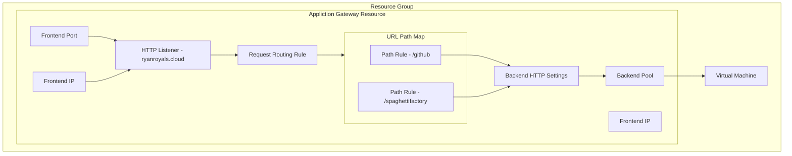

---
{"dg-publish":true,"dg-path":"Azure Application Gateway.md","permalink":"/Azure Application Gateway/","tags":["notes"]}
---

## Azure Application Gateway

### Overview

Azure Application Gateway is a [[30 Slipbox/OSI Networking Model#Layer 7 - Application\|Layer 7]] web traffic load balancer used to balance and separate traffic to route to its most ideal destination.  
Application Gateways are tied to a region, which is a key difference to [[30 Slipbox/Azure Front Door\|Azure Front Door]].

#### SKUs

Application gateway is available in 2 skus ([as v1 SKUs are being decommissioned as of 2023]([We're retiring Application Gateway V1 SKU in April 2026 - Azure Application Gateway | Microsoft Learn](https://learn.microsoft.com/en-us/azure/application-gateway/v1-retirement)))

| Standard_v2               | WAF_v2                     |
| ------------------------- | -------------------------- |
| Requires Public IP        | Does not require public IP |
| Can not do Firewall rules | Can do firewall rules      |
| ~ $300 pm                 | ~$600 pm                   |

When using the Standard SKU, traffic can be filtered to route only from the Private endpoint, leaving the Public IP with minimal function.

### Configuration

#### Configuration for App Service

- DNS name must be consistent through the whole configuration.
- Certificate can not be Managed by App Service, it has to be supplied from a Key Vault.

### Troubleshooting and Notes

- App gateway works with something like last known good config. If you make a bad change (Like it can not read a key vault secret), any further updates will fail until this issue is resolved.
- Each Backend Setting needs its own health probe if it is using a custom port.
- Rewrite rules header bools need to be UPPER CASE
