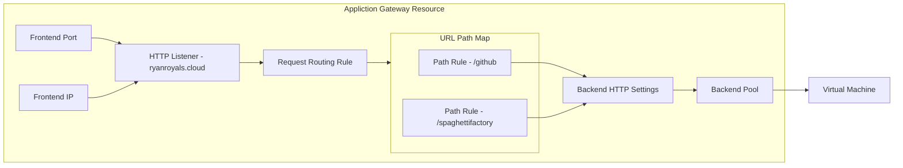

---
{"dg-publish":true,"dg-path":"Azure Application Gateway.md","permalink":"/azure-application-gateway/","tags":["notes"]}
---

## Overview

Azure Application Gateway is a [[30 Slipbox/OSI Networking Model#Layer 7 - Application\|Layer 7]] web traffic load balancer used to balance and separate traffic to route to its most ideal destination.  
Application Gateways are tied to a region, which is a key difference to [[30 Slipbox/Azure Front Door\|Azure Front Door]].  

Azure Application Gateway includes the following features:

- Support for the HTTP, HTTPS, HTTP/2, and WebSocket protocols
- A web application firewall to protect against web application vulnerabilities
- End-to-end request encryption
- Autoscaling to dynamically adjust capacity as your web traffic load change
- Connection draining allowing graceful removal of back-end pool members during planned service updates

- **Front-end IP address**: Client requests are received through a front-end IP address. You can configure Application Gateway to have a public IP address, a private IP address, or both. Application Gateway can't have more than one public IP address and one private IP address.
- **Listeners**: Application Gateway uses one or more listeners to receive incoming requests. A listener accepts traffic arriving on a specified combination of protocol, port, host, and IP address. Each listener routes requests to a back-end pool of servers following routing rules that you specify. A listener can be Basic or Multi-site. A *Basic* listener only routes a request based on the path in the URL. A *Multi-site* listener can also route requests using the hostname element of the URL. Listeners also handle TLS/SSL certificates for securing your application between the user and Application Gateway.
- **Routing rules**: A routing rule binds a listener to the back-end pools. A rule specifies how to interpret the hostname and path elements in the URL of a request and direct the request to the appropriate back-end pool. A routing rule also has an associated set of HTTP settings. These HTTP settings indicate whether (and how) traffic is encrypted between Application Gateway and the back-end servers. Other configuration information includes Protocol, Session stickiness, Connection draining, Request timeout period, and Health probes.  
[^1]

## SKUs

Application gateway is available in 2 skus ([as v1 SKUs are being decommissioned as of 2023]([We're retiring Application Gateway V1 SKU in April 2026 - Azure Application Gateway | Microsoft Learn](https://learn.microsoft.com/en-us/azure/application-gateway/v1-retirement)))

| Standard_v2               | WAF_v2                     |
| ------------------------- | -------------------------- |
| Requires Public IP        | Does not require public IP |
| Can not do Firewall rules | Can do firewall rules      |
| ~ $300 pm                 | ~$600 pm                   |

When using the Standard SKU, traffic can be filtered to route only from the Private endpoint, leaving the Public IP with minimal function.

## Configuration

### Web Application Firewall

The web application firewall (WAF) is an optional component that handles incoming requests before they reach a listener. The web application firewall checks each request for many common threats based on the Open Web Application Security Project (OWASP). Common threats include: SQL-injection, Cross-site scripting, Command injection, HTTP request smuggling, HTTP response splitting, Remote file inclusion, Bots, crawlers, and scanners, and HTTP protocol violations and anomalies.

OWASP defines a set of generic rules for detecting attacks. These rules are referred to as the Core Rule Set (CRS). The rule sets are under continuous review as attacks evolve in sophistication. WAF supports four rule sets: CRS 3.2, 3.1, 3.0 and 2.2.9. CRS 3.1 is the default. If necessary, you can opt to select only specific rules in a rule set, targeting certain threats. Additionally, you can customize the firewall to specify which elements in a request to examine, and limit the size of messages to prevent massive uploads from overwhelming your servers.  
[^1]

### Routing

#### Path-based Routing

Path-based routing sends requests with different URL paths to different pools of back-end servers. For example, you could direct requests with the path /video/* to a back-end pool containing servers that are optimized to handle video streaming, and direct /images/* requests to a pool of servers that handle image retrieval.

  
[^1]

#### Multiple-site Routing

Multiple-site routing configures more than one web application on the same Application Gateway instance. In a multi-site configuration, you register multiple DNS names (CNAMEs) for the IP address of the application gateway, specifying the name of each site. Application Gateway uses separate listeners to wait for requests for each site. Each listener passes the request to a different rule, which can route the requests to servers in a different back-end pool. For example, you could direct all requests for `http://contoso.com` to servers in one back-end pool, and requests for `http://fabrikam.com` to another back-end pool. The following diagram shows this configuration:

Multi-site configurations are useful for supporting multitenant applications, where each tenant has its own set of virtual machines or other resources hosting a web application.

Application Gateway routing also includes these features:

- **Redirection**. Redirection can be used to another site, or from HTTP to HTTPS.
- **Rewrite HTTP headers**. HTTP headers allow the client and server to pass parameter information with the request or the response.
- **Custom error pages**. Application Gateway allows you to create custom error pages instead of displaying default error pages. You can use your own branding and layout using a custom error page.  
[^1]

### Back-end Pools

A back-end pool is a collection of web servers that can be made up of: a fixed set of virtual machines, a virtual machine scale-set, an app hosted by Azure App Services, or a collection of on-premises servers.

Each back-end pool has an associated load balancer that distributes work across the pool. When configuring the pool, you provide the IP address or name of each web server. All the servers in the back-end pool should be configured in the same way, including their security settings.

If you're using TLS/SSL, the back-end pool has an HTTP setting that references a certificate used to authenticate the back-end servers. The gateway re-encrypts the traffic by using this certificate before sending it to one of your servers in the back-end pool.

If you're using Azure App Service to host the back-end application, you don't need to install any certificates in Application Gateway to connect to the back-end pool. All communications are automatically encrypted. Application Gateway trusts the servers because Azure manages them.

Application Gateway uses a rule to specify how to direct the messages that it receives on its incoming port to the servers in the back-end pool. If the servers are using TLS/SSL, you must configure the rule to indicate:

- That your servers expect traffic through the HTTPS protocol.
- Which certificate to use to encrypt traffic and authenticate the connection to a server.  
[^1]

### TLS / SSL Termination

When you terminate the TLS/SSL connection at the application gateway, it offloads the CPU-intensive TLS/SSL termination workload from your servers. Also, you don’t need to install certificates and configure TLS/SSL on your servers.

If you need end-to-end encryption, Application Gateway can decrypt the traffic on the gateway by using your private key, then re-encrypt again with the public key of the service running in the back-end pool.

Traffic enters the gateway through a front-end port. You can open many ports, and Application Gateway can receive messages on any of these ports. A listener is the first thing that your traffic meets when entering the gateway through a port. The listener is set up to listen for a specific host name, and a specific port on a specific IP address. The listener can use an TLS/SSL certificate to decrypt the traffic that enters the gateway. The listener then uses a rule that you define to direct the incoming requests to a back-end pool.

Exposing your website or web application through the application gateway also means that you don't directly connect your servers to the web. You're exposing only port 80 or port 443 on the application gateway, which is then forwarded to the back-end pool server. In this configuration, your web servers aren't directly accessible from the internet, which reduces the attack surface of your infrastructure.  
[^1]

### Health Probes

Health probes determine which servers are available for load-balancing in a back-end pool. The Application Gateway uses a health probe to send a request to a server. When the server returns an HTTP response with a status code between 200 and 399, the server is considered healthy. If you don't configure a health probe, Application Gateway creates a default probe that waits for 30 seconds before deciding that a server is unavailable. Health probes ensure that traffic isn't directed to a nonresponsive or failed web endpoint in the back-end pool.  
[^1]

| Probe Property      | Value                            | Description                                                                                                                                                                                                                                                                                                                                                                                                                    |     |
| ------------------- | -------------------------------- | ------------------------------------------------------------------------------------------------------------------------------------------------------------------------------------------------------------------------------------------------------------------------------------------------------------------------------------------------------------------------------------------------------------------------------ | --- |
| Probe URL           | `<protocol>://127.0.0.1:<port>/` | The protocol and port are inherited from the backend HTTP settings to which the probe is associated                                                                                                                                                                                                                                                                                                                            |     |
| Interval            | 30                               | The amount of time in seconds to wait before the next health probe is sent.                                                                                                                                                                                                                                                                                                                                                    |     |
| Time-out            | 30                               | The amount of time in seconds the application gateway waits for a probe response before marking the probe as unhealthy. If a probe returns as healthy, the corresponding backend is immediately marked as healthy.                                                                                                                                                                                                             |     |
| Unhealthy threshold | 3                                | Governs how many probes to send in case there's a failure of the regular health probe. In v1 SKU, these additional health probes are sent in quick succession to determine the health of the backend quickly and don't wait  for the probe interval. In the case of v2 SKU, the health probes wait the interval. The back-end server is marked down after the consecutive probe failure count reaches the unhealthy threshold. |     |

[^2]

#### Custom Health Probes

Custom probes give you more granular control over the health monitoring. When using custom probes, you can configure a custom hostname, URL path, probe interval, and how many failed responses to accept before marking the back-end pool instance as unhealthy, etc.

The following table provides definitions for the properties of a custom health probe.

| Probe property      | Description                                                                                                                                                                              |
| ------------------- | ---------------------------------------------------------------------------------------------------------------------------------------------------------------------------------------- |
| Name                | Name of the probe. This name is used to identify and refer to the probe in back-end HTTP settings.                                                                                       |
| Protocol            | Protocol used to send the probe. This property must match with the protocol defined in the back-end HTTP settings it is associated to                                                    |
| Host                | Host name to send the probe with. In v1 SKU, this value is used only for the host header of the probe request. In v2 SKU, it's used both as host header and SNI                          |
| Path                | Relative path of the probe. A valid path starts with '/'                                                                                                                                 |
| Port                | If defined, this property is used as the destination port. Otherwise, it uses the same port as the HTTP settings that it is associated to. This property is only available in the v2 SKU |
| Interval            | Probe interval in seconds. This value is the time interval between two consecutive probes                                                                                                |
| Time-out            | Probe time-out in seconds. If a valid response isn't received within this time-out period, the probe is marked as failed                                                                 |
| Unhealthy threshold | Probe retry count. The back-end server is marked down after the consecutive probe failure count reaches the unhealthy threshold                                                          |  

[^2]

### Autoscaling

Application Gateway supports autoscaling, and can scale up or down based on changing traffic load patterns. Autoscaling also removes the requirement to choose a deployment size or instance count during provisioning.  
[^1]

### WebSocket and HTTP/2 Traffic

Application Gateway provides native support for the WebSocket and HTTP/2 protocols. The WebSocket and HTTP/2 protocols enable full duplex communication between a server and a client over a long-running TCP connection. This type of communication is more interactive between the web server and the client, and can be bidirectional without the need for polling as required in HTTP-based implementations. These protocols have low overhead (unlike HTTP) and can reuse the same TCP connection for multiple request/responses resulting in a more efficient resource utilization. These protocols are designed to work over traditional HTTP ports of 80 and 443.  
[^1]

## Troubleshooting and Notes

- App gateway works with something like last known good config. If you make a bad change (Like it can not read a key vault secret), any further updates will fail until this issue is resolved.
- Each Backend Setting needs its own health probe if it is using a custom port.
- Rewrite rules header bools need to be UPPER CASE

### Configuration for App Service

- DNS name must be consistent through the whole configuration.
- Certificate can not be Managed by App Service, it has to be supplied from a Key Vault.

[^1]: [[40 References/readwise/Design Azure Application Gateway - Training\|Design Azure Application Gateway - Training]]
[^2]: [[40 References/readwise/Configure Azure Application Gateway - Training\|Configure Azure Application Gateway - Training]]
