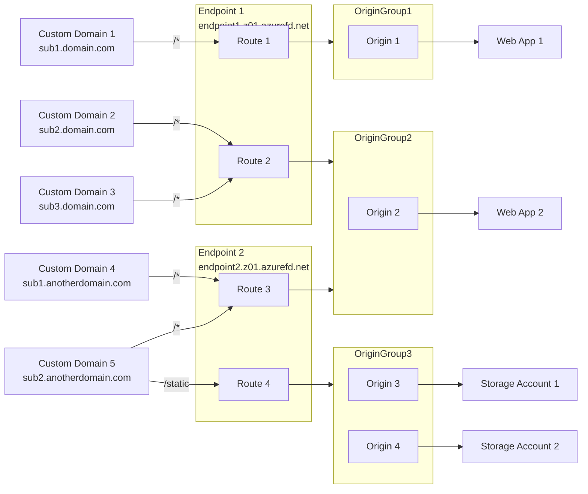

---
{"dg-publish":true,"dg-path":"Azure Front Door.md","permalink":"/Azure Front Door/","tags":["notes"]}
---

## Azure Front Door

### Overview

Azure Front Door is a [[CDN\|CDN]] and [[WAF\|WAF]] solution for delivering content, files, apps or APIs.  
Front Door is not directly tied to a Azure Region, and instead leverages over 118 Edge Locations.

### SKU Feature Comparison

Azure Front Door is available in 2 different SKU's: **Standard** and **Premium**.  
Each SKU has a base cost, and additional fee's for Ingress and Egress data.  
More information is available [Here]([Pricing - Front Door | Microsoft Azure](https://azure.microsoft.com/en-us/pricing/details/frontdoor/))

**Standard** starts at $54 AUD a month, and has enough features to get a full [[CDN\|CDN]] experience from the Resource, but the WAF only has support for Custom Rule Sets

**Premium** starts at $510 AUD a month, but has Microsoft managed rulesets in the WAF, and for the Front Door to connect to [[30 Slipbox/Azure Private Endpoint\|Private Endpoints]]

### Traffic Routing

Traffic through the Azure Front Door is co ordinated by **Custom Domains**, **Endpoints**, **Origins**, **Origin Groups**, and **Routes**

CNAME record: \*.domain.com-> endpoint1.z01.azurefd.net  
CNAME record: sub1.anotherdomain.com-> endpoint2.z01.azurefd.net  
CNAME record: sub2.anotherdomain.com-> endpoint2.z01.azurefd.net

**Custom Domain Names** are external names that the Front Door listens for on the Endpoint. This can be either a Apex domain, or a Sub domain. When using Wildcard subdomains, a BYO Certificate is required.

**Endpoints** are a collection of Routes. Should be used as a lifecycle collection (Disable at the same time, share a similar purpose, much like a RG). There is a limit of 10/25 Endpoints per Standard/Premium Profile.

**Origin Groups** are a collection of **Origins**, which represent the resource you are directing traffic to. This could be separate Storage Accounts across multiple regions.

**Routes** wrap up Endpoints and Origins, directing the traffic as configured in the routing rule set.

### Web Application Firewall

Azure Web Application Firewall (WAF) on Azure Front Door provides centralized protection for your web applications. This allows you to protect against common vulnerabilities, Malicious Bots, DDoS attacks and other web based attacks.

WAF can be deployed in either **Detection Mode** to only report, or **Prevention Mode** to act on issues found.

### Troubleshooting

#### Custom Domain Not Validating

When authenticating custom domains against Azure FrontDoor, its important to note that if it says Timeout, you need to regenerate the txt record, otherwise it will not actually check again.
