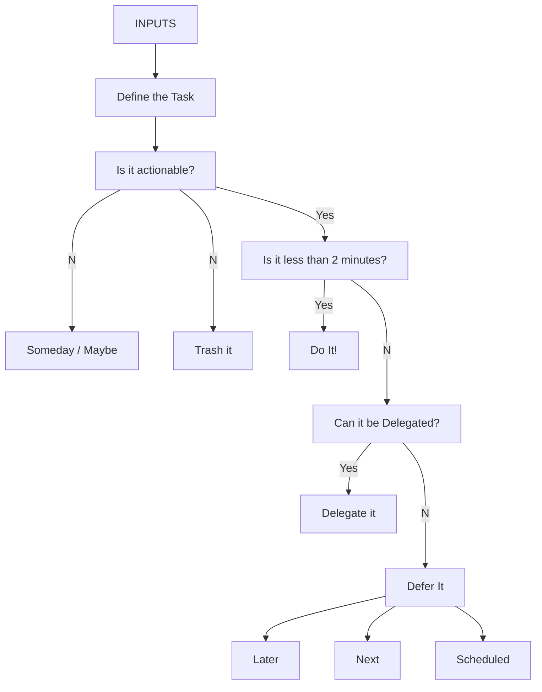

---
{"dg-publish":true,"dg-path":"Get Things Done Method.md","permalink":"/Get Things Done Method/","tags":["notes"]}
---

## Get Things Done Method

[^1]

Get things Done is a simple system for managing work. There is a famous book the defines the process in great detail, but in system is effectively a re occurring task to check your backlog, and a flowchart for handling tasks themselves.

It aggressively actions items, schedules them for when they are due, or trashes it.

The system also offers a way to manage reference materials, agendas for meetings, and task for context (At Computer, At Home).

[^1]: [[40 References/readwise/Getting Things Done (GTD) Flowchart A Complete Guide\|Getting Things Done (GTD) Flowchart A Complete Guide]]
