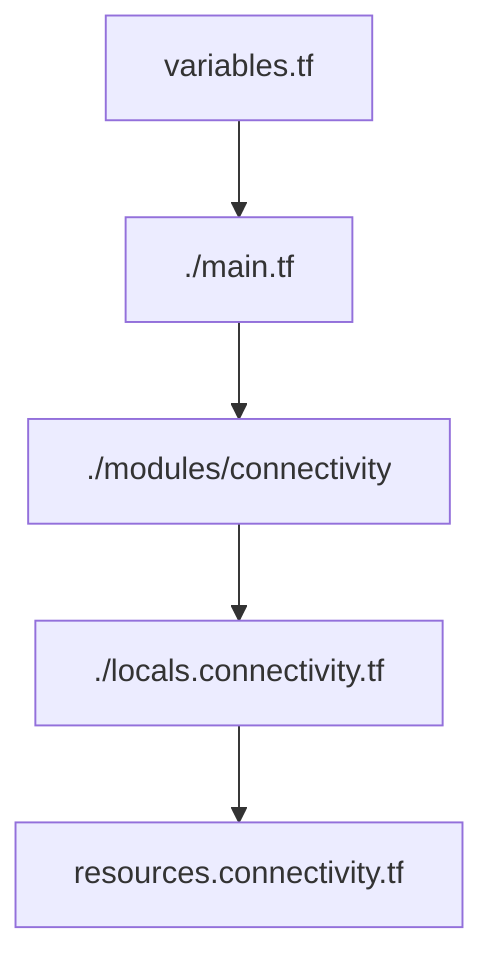

---
{"dg-publish":true,"dg-path":"How CAF TF module works.md","permalink":"/how-caf-tf-module-works/","tags":["notes"]}
---

## How CAF TF Module Works

[Azure/terraform-azurerm-caf-enterprise-scale: Azure landing zones Terraform module (github.com)](https://github.com/Azure/terraform-azurerm-caf-enterprise-scale/tree/main)

1. `Main.tf` calls the `connectivity` module  
2. `Connectivity` module is just a place to digest variables, and outputs a single *configuration* block.  
3. `locals.connectivity.tf` builds out any objects that need to be looped over.  
4. `resources.connectivity.tf` then reads the config as present in the `locals.connectivity.tf` to do the deploy

### Why I Think it Does This

Each module is called with its own Terraform Provider which has the limitation of not being able to be nested within a Module, otherwise it is treated as a *Terraform Legacy Module*, which can be very hard to maintain.  
It also allows you deploy parts of the CAF Enterprise Scale per calling of the module, which could be spread over multiple repositories.
