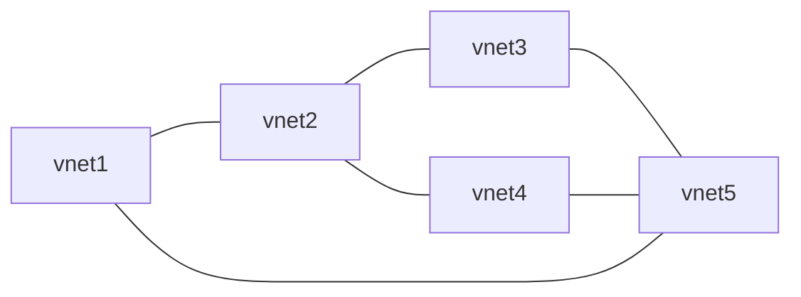

---
{"dg-publish":true,"dg-path":"Peering Azure Virtual Networks.md","permalink":"/peering-azure-virtual-networks/","tags":["notes"]}
---

[[30 Slipbox/Azure Virtual Network\|Virtual Networks]] can be peered globally as long as the Address Space does not overlap with either the VNET or other VNETs that are peered in the mesh.

Whenever a VNET is peered, the [[30 Slipbox/Routing in Azure\|Default Route Table]] is updated to include the new routes for all VNETs.  
This is important to remember when [[Force Tuneling\|Force Tuneling]] traffic to a Network Virtual Appliance like a [[30 Slipbox/Azure Firewall\|Azure Firewall]].  
It is also important to note that Vnet 1 can not communicate with Vnet 3 or 4 in this diagram, as Azure does not have [[30 Slipbox/Transitive Routing\|Transitive Routing]]
