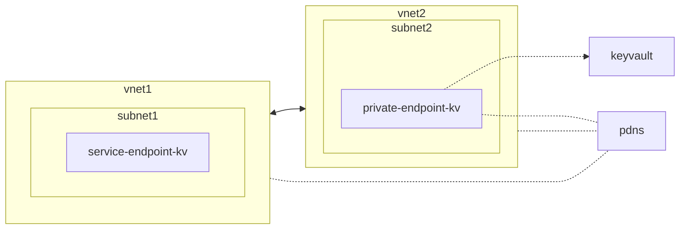
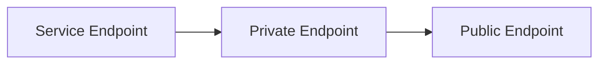

---
{"dg-publish":true,"dg-path":"Service Endpoint and Private Endpoint overlap.md","permalink":"/service-endpoint-and-private-endpoint-overlap/","tags":["notes"]}
---

Private Endpoints grant network access to specific resources behind a given service providing granular segmentation. Traffic can reach the service resource from on premises without using public endpoints.

A service endpoint remains a publicly routable IP address. A private endpoint is a private IP in the address space of the virtual network where the private endpoint is configured.

> [!note]  
> Microsoft recommends use of Azure Private Link for secure and private access to services hosted on Azure platform.

## Troubleshooting

Found that if you have Private Endpoint on a Keyvault in Vnet 2, but in Vnet 1 you have a Service Endpoint for KV on the subnet, yo will also need to allow the VNET on the Keyvault, as it looks like the priority for traffic is

When troubleshooting, errors may show that the Private IP space of `subnet1` is not authorised on the firewall.
