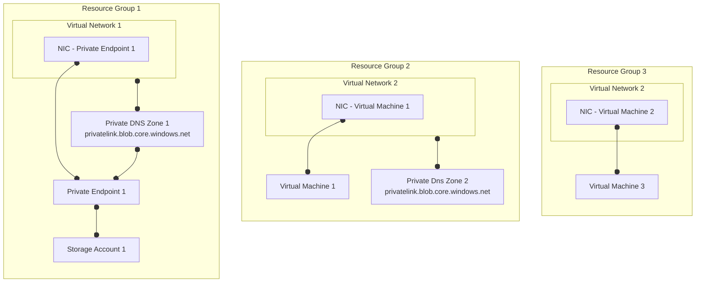
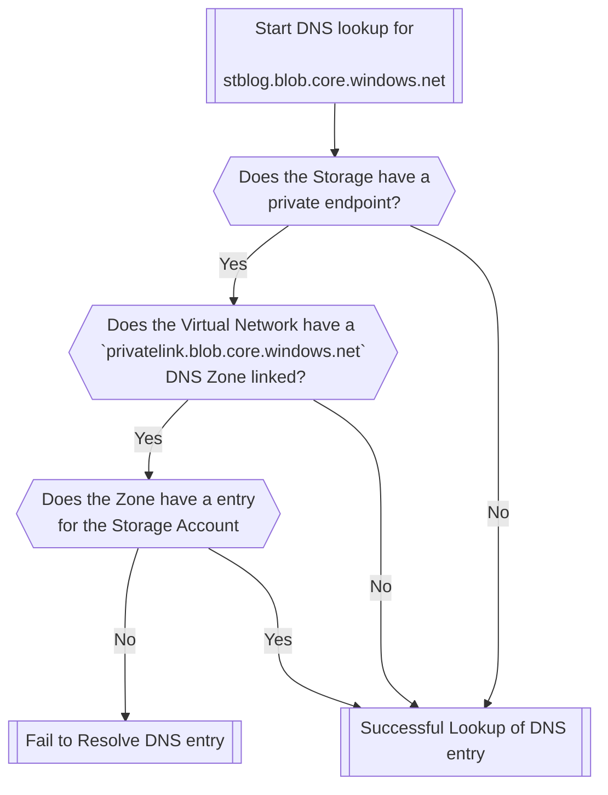

---
{"dg-publish":true,"dg-path":"Can't resolve Storage Account DNS from VNET, but can from Internet.md","permalink":"/can-t-resolve-storage-account-dns-from-vnet-but-can-from-internet/","tags":["blogs"]}
---


## Problem Statement

An ambiguous name for a hard to track down issue!  
When you are doing a `NSlookup` for a blob endpoint on a Storage Account in a Virtual Network in Azure, you may be getting a response that looks like this :

```pwsh
# Failing
PS C:\Users\ladmin> nslookup stblog.blob.core.windows.net
Server:  UnKnown
Address:  168.63.129.16

Non-authoritative answer:
Name:    stblog.blob.core.windows.net
```

Usually when you do a `NSLookup` on a working storage account, the response looks like the below. This response is also what you get from the your local machine / the internet.

```pwsh
# Working
PS C:\Users\ladmin> nslookup stblog.blob.core.windows.net
Server:  UnKnown
Address:  168.63.129.16

Non-authoritative answer:
Name:    blob.syd27prdstr06a.store.core.windows.net
Address:  20.60.73.234
Aliases:  stblog.blob.core.windows.net
          stblog.privatelink.blob.core.windows.net
```

## Explanation

In the example we discovered, the issue is in relation to Azure Private Endpoints, and more specifically the Azure Private DNS Zone. Note I'm using `privatelink.blob.core.windows.net` and the `blob` endpoint on a Storage Account as a example, but this is the same for all Private Endpoints.  
In our lab, it looks like this:



In this example **Virtual Machine 2** wants to connect to **Storage Account 1**'s blob endpoint.  

- **Resource Group 1** contains **Storage Account 1** that has a **Private Endpoint 1** which *has a DNS entry* in **Private DNS Zone 1**.
- **Resource Group 2** contains **Virtual Network 2**, with its own **Private DNS Zone 2** that has *no DNS entry* for **Storage Account 1**.
- **Resource Group 3** is much the same as Resource Group 1, but *does not* have a Private DNS Zone associated to **Virtual Network 3**.

The issue that causes the errors above lies in that Virtual Network 2 is using the default Azure DNS (Through the [Magic IP](https://learn.microsoft.com/en-us/azure/virtual-network/what-is-ip-address-168-63-129-16)), and has a `privatelink.blob.core.windows.net` zone associated to it.  
This Zone does not have a entry for Storage Account 1, which then fails the lookup. This is notably frustrating to find as lookups from Virtual Machine 2 (without the PDNS Zone) or the general Internet work as expected.

From our testing, the DNS name resolution workflow in Azure looks like this:



This is a little counter intuitive, as typically a `CNAME` record would facilitate the `*.blob.core.windows.net` to `*.privatelink.blob.core.windows.net` conversion, but it appears that Azure is using some logic in the background to shortcut this.

## Resolution

Effectively there are 2 ways to resolve this issue, either *unlink* the `privatelink.blob.core.windows.net` from **Virtual Network 2**, or *associate* a Private Endpoint for Storage Account 1 to Private DNS Zone 1, so that Virtual Network 1 can can look it up.  
Ideally you always have a central collection of Private DNS Zones that link to all Virtual Networks in your environment (Which is something we provision in Elements Core), but in use cases where that is not possible (Like in a Synapse or Data Factory Managed Virtual Network), it is worth noting that if Azure knows that you have a Private Endpoint on your destination resource, and if you have the matching Private DNS Zone on your Virtual Network, Azure will aggressively assume that the DNS entry exists in the Private DNS Zone.
