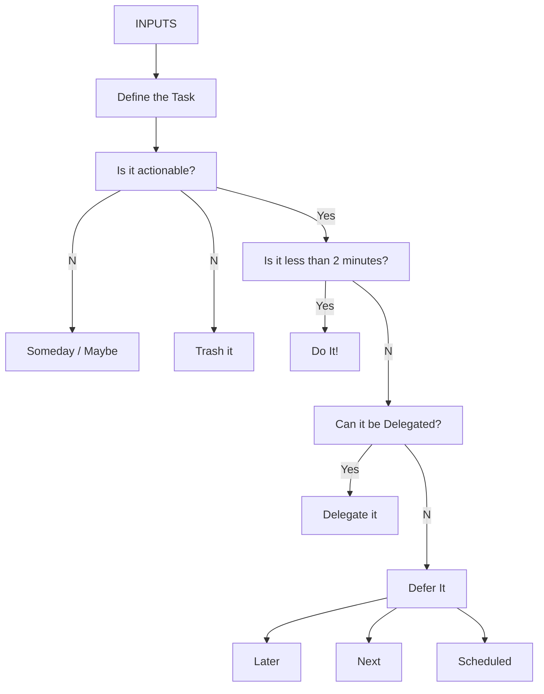

---
{"dg-publish":true,"permalink":"/90-slipbox/get-things-done-method/","tags":["notes"],"created":"2023-07-24","updated":"2026-03-03","dg-note-properties":{"created":"2023-07-24","modified":"2026-03-03","tags":"notes","references":["https://obsidian.rocks/obsidian-and-gtd/","https://todoist.com/productivity-methods/getting-things-done","https://www.zenflowchart.com/guides/gtd-flowchart"],"related":["[[Note Taking and Productivity]]"]}}
---

[^1]

Get things Done is a simple system for managing work. There is a famous book the defines the process in great detail, but in system is effectively a re occurring task to check your backlog, and a flowchart for handling tasks themselves.

It aggressively actions items, schedules them for when they are due, or trashes it.

The system also offers a way to manage reference materials, agendas for meetings, and task for context (At Computer, At Home).

[^1]: [Getting Things Done (GTD) Flowchart A Complete Guide](https://www.zenflowchart.com/guides/gtd-flowchart)
