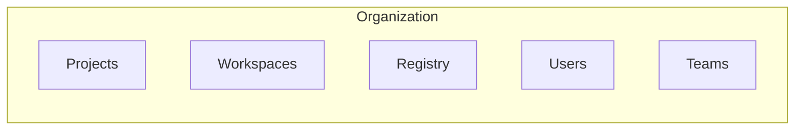

---
{"dg-publish":true,"permalink":"/90-slipbox/hcp-for-private-module-distribution/","tags":["notes"]}
---

[[90_slipbox/HashiCorp Cloud Platform\|HCP]] provides a Private Registry that you can use to distribute Modules and Providers to your Users without giving them access to the source code repositories in Version Control System (VCS)  
This is done through the use of `credential` blocks in Terraform, and API Keys.

Modules and Providers are published at the Organization layer, which is the top layer to HCP. All Users and Teams in a Organization have access to interact with all Modules and Providers, without a way to restrict to certain teams.

As [[90_slipbox/Arkahna\|Arkahna]], we could set up a Organization per customer, and then they could self service access to any Modules we chose to publish to the Organization.  
This approach would work, but if the customer removed us from the Organization, we would have no way to unpublish the module, making it so any subscription based approach would be easy to work around as we can not revoke access.

[[90_slipbox/Terraform Enterprise\|Terraform Enterprise]] allows you to have a *Enterprise* that sits on top of *Organizations*, which appears to give you control on which Modules to publish, but is a paid self hosted version of HCP.
