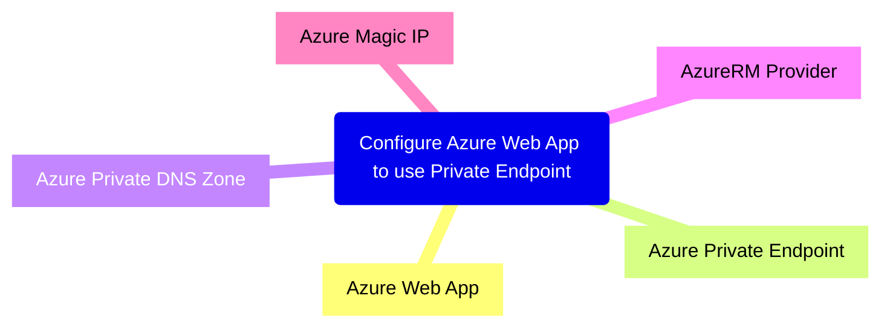

---
{"dg-publish":true,"permalink":"/90-slipbox/note-taking-tips/","tags":["notes"]}
---

- Its easy to understand when to make a new note if you feel like you want to link it to 2 different Ideas
    - 2025-11-28: I wish it was this simple. I have been packing a lot of these files up

- Templates are a nice to have and help you start to put more meta data on your notes, but are not a big deal
- Context is key. Linking things together makes it all makes sense, as well as clever tags and such.
- Keep notes simple. A great part of the Zettelkasten method is that it keeps the context small so it does not start to drift.
