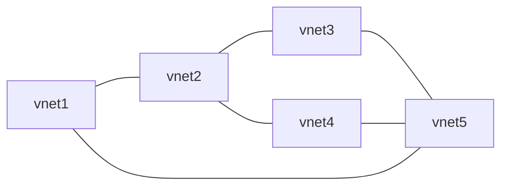

---
{"dg-publish":true,"dg-path":"Slipbox Notes/Peering Azure Virtual Networks.md","permalink":"/slipbox-notes/peering-azure-virtual-networks/","tags":["notes"],"created":"2023-09-04","updated":"2025-11-27"}
---

[[90_slipbox/Azure Virtual Network\|Virtual Networks]] can be peered globally as long as the Address Space does not overlap with either the VNET or other VNETs that are peered in the mesh.

Whenever a VNET is peered, the [[90_slipbox/Routing in Azure\|Default Route Table]] is updated to include the new routes for all VNETs.  
This is important to remember when Force Tunnelling traffic to a Network Virtual Appliance like a [[90_slipbox/Azure Firewall\|Azure Firewall]].  
It is also important to note that Vnet 1 can not communicate with Vnet 3 or 4 in this diagram, as Azure does not have [[90_slipbox/Transitive Routing\|Transitive Routing]]
