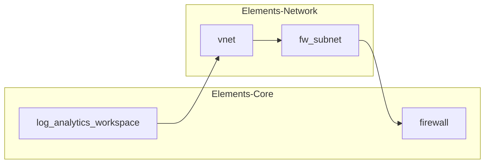
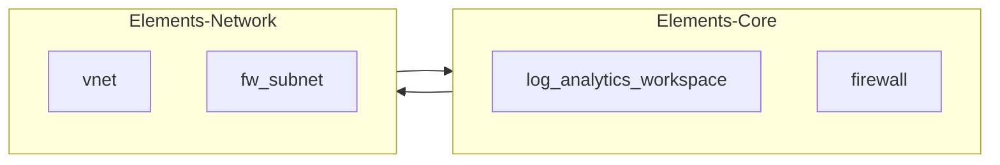

---
{"dg-publish":true,"permalink":"/90-slipbox/terragrunt/","tags":["notes"]}
---

## Overview

[Terragrunt]([Terragrunt | Terraform wrapper (gruntwork.io)](https://terragrunt.gruntwork.io/)) is a wrapper over [Terraform]([Terraform by HashiCorp](https://www.terraform.io/)) that allows you to keep you code DRY (Don't Repeat Yourself).  
It does this by effectively adding the power to inherit from files outside of the current directory.

Using Terragrunt, you can deploy complex environments rapidly with the clever use of **.hcl** files.  
It is a very clean solution to making a environment copy/paste-able, as if you configure it right you only need to modify the one file to have a flow on effect to the rest of the deployment.  
  
In this example, **Global.hcl** has the Resource Prefix for naming, **Env.hcl** has the environment tag and the backend state file configuration, and **Terragrunt.hcl** has the reference to the module that is being deployed.

## My Experience in Using Terragrunt

### Pro 1 - Repository Management

Terragrunt offers tools to manage all of Terraform configurations between different environments with a single command. It also offers a clean tooling to only run apply actions on modified code, reducing spend in pipeline minutes.

### Pro 2 - DRY Configurations

Terragrunts approach to "Don't Repeat Yourself" configurations makes it quick to drop in new modules to the deployment, without ever having to modify the code of the module, as everything will inherit from above (If configured correctly).

### Pro/Con 1 - Everything is Module

Everything needs to be a module, with Inputs, Outputs and Variables. This does promote a best practise approach to creation of the environment, but also adds additional complexity to make a small change, or to implement a small resource (Resource Group).

A failing in this approach is when working across multiple clients, a central library of modules is all but required to get the best value. Terragrunt/Terraform offer tools to version lock these remote modules which helps. A issue with this approach is Terragrunt still downloads the whole remote repository to access the particular module it requires, leaving no room for selective access to IP.  
A workaround solution can be found, but it would require external tooling.

### Pro/Con 2 - Consistency in Approach

To fully get the most power out of Terragrunt, a consistent approach to variables in modules, locals within **.hcl** files, naming of **.hcl** files and directory structure need to be well established and understood, otherwise the configuration will fail. This is highly reproducible, but hard to manage for multiple clients with varying needs.

### Pro/Con 3 - External Documentation

Gruntwork offer a good [collection of documentation]([Documentation (gruntwork.io)](https://terragrunt.gruntwork.io/docs/)) to onboard your configuration to Terragrunt, but this is required reading as otherwise Terragrunt is very hard to intuitively understand and use.

### Con 1 - Outputs between Modules

Short comings emerge when passing outputs between modules. This works like normal Terraform, where a output does not exist until Apply time. Terragrunt does not solve this issue directly, but instead offers the tool to mock outputs so a end to end plan using the `run-all` can succeed. This creates a large amount of overhead and is messy to work with.

### Con 2 - Circular Dependencies

All though a edge case and perhaps not best practise, Terragrunt presents 0 tools to work through circular dependencies. In normal Terraform, if you have 2 modules (Network and Core), each module can reference each other based on the outputs, and render out the values at deploy time.

#### Terraform Dependencies Management

Terraform does not see the border of a module, but instead uses its dependacy graph to create the easiest path to deploy all resources.

#### Terragrunt Dependencies Management

Terragrunt respects the boundary of a module, and expects each module to deploy sequentially, otherwise it will fail.

## Recommendations

My suggestion is unfortunately to not use Terragrunt. All though I can see great value in the tool, I have reservations on its ability to scale across a team without a large amount of training and upkeep of skills, at least in direct comparison to using Terraform and **.tfvars** files.
