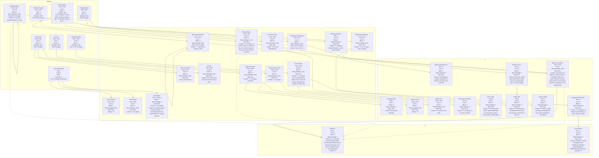

---
{"dg-publish":true,"permalink":"/notes/ninja-combo-lines/","tags":["notes"]}
---

## Ninja Combo Lines

```mermaid
flowchart TD

%% Starters
	tot[Torrent of Tempo \n Pitch: 1/2/3 \n Cost: 1 \n Block: 3 \n Damage: 5/4/3 \n Text: on hit Go Again]
	ct[Crouching Tigers \n Pitch: \n Cost: 0 \n Block: \n Damage: 0 \n Text: Go Again, Ephemeral]
	tt[Twin Twisters \n Pitch: 1/2/3 \n Cost: 1 \n Block: 2 \n Damage: 3/2/1 \n Text: Go Again, Choose either on hit next attack gets +1 OR Twin Twisters gets +1]
	ss[Surging Strike \n Pitch: 1/2/3 \n Cost: 2 \n Block: 2 \n Damage: 5/4/3 \n Text: Go Again]
	lt[Leg Tap \n Pitch: 1/2/3 \n Cost: 1 \n Block: 2 \n Damage: 4/3/2 \n Text: Go Again]
	hj[Head Jab \n Pitch: 1/2/3 \n Cost: 0 \n Block: 2 \n Damage: 3/2/1 \n Text: Go Again]
	sbs[Soulbead Strike \n Pitch: 1/2/3 \n Cost: 0 \n Block: 3 \n Damage: 4/3/2 \n Text: on hit Go Again]


%% Combo
	otc[Open the Center \n Pitch: 1/2/3 \n Cost: 2 \n Block: 3 \n Base Damage: 5/4/3 \n Base Text: \n Combo: +1, Go Again,  Dominate]
	pg[Pounding Gale \n Pitch: 1 \n Cost: 1 \n Block: 3 \n Base Damage: 5 \n Base Text: \n Combo: Deal double damage]
	qu[Qi Unleashed \n Pitch: 1/2/3 \n Cost: 2 \n Block: 3 \n Base Damage: 3/2/1 \n Base Text: \n Combo: +4]
	bk[Blackout Kick \n Pitch: 1/2/3 \n Cost: 1 \n Block: 3 \n Base Damage: 4/3/2 \n Base Text:  \n Combo: +3]
	pq[Pouncing Qi \n Pitch: 1/2/3 \n Cost: 0 \n Block: 3 \n Base Damage: 3/2/1 \n Base Text: \n Combo: +1, Go Again]
	rkt[Rising Knee Thrust \n Pitch: 1/2/3 \n Cost: 0 \n Block: 3 \n Base Damage: 3/2/1 \n Base Text: \n Combo: +2, Go Again]

	dg[Descendent Gustwave \n Pitch: 1/2/3 \n Cost: 1 \n Block: 2 \n Base Damage: 3/2/1 \n Base Text: Go Again \n Combo: Cost 1 less, +2 ]
	otp[One-Two Punch \n Pitch: 1/2/3 \n Cost: 0 \n Block: 3 \n Base Damage: 3/2/1 \n Base Text: \n Combo: On hit deal 2]
	wg[Whelming Gustwave \n Pitch: 1/2/3 \n Cost: 0 \n Block: 3 \n Base Damage: 3/2/1 \n Base Text: \n Combo: +1, on hit draw a card, Go Again]
	ff[Fluster Fist \n Pitch: 1/2/3 \n Cost: 0 \n Block: 3 \n Base Damage: 4/3/2 \n Base Text: \n Combo: +1 for each hit on chain]
	bhk[Back Heel Kick \n Pitch: 1/2/3 \n Cost: 0 \n Block: 3 \n Base Damage: 3/2/1 \n Base Text: \n Combo: +1 for each damage gain]
	ht[Hurricane Technique \n Pitch: 1 \n Cost: 1 \n Block: 3 \n Base Damage: 4 \n Base Text: \n Combo: +1, Go Again, on hit return to hand]
	hw[Hundred Winds \n Pitch: 1/2/3 \n Cost: 0 \n Block: 2 \n Base Damage: 3/2/1 \n Base Text: Go Again \n Combo: +1 for each Hundred Winds on chain]
	cr[Cyclone Roundhouse \n Pitch: 2 \n Cost: 2 \n Block: 3 \n Base Damage: 5 \n Base Text: \n Combo: at beginning of reaction step bansih a random card from each chain link]
	r[Recoil \n Pitch: 1/2/3 \n Cost: 0 \n Block: 3 \n Base Damage: 3/2/1 \n Base Text: \n Combo: On hit they put a card form hand on top of deck]
	swk[Spinning Wheel Kick \n Pitch: 1/2/3 \n Cost: 1 \n Block: 2 \n Base Damage: 4/3/2 \n Base Text: Go Again \n Combo: +1, put back on bottom of deck]
	woe[Winds of Eternity \n Pitch: 3 \n Cost: 0 \n Block: 3 \n Base Damage: 2 \n Base Text: \n Combo: +2, shuffle all Hundred Winds on chain back into deck]
	cd[Crane Dance \n Pitch: 1/2/3 \n Cost: 0 \n Block: 3 \n Base Damage: 3/2/1 \n Base Text: \n Combo: +1, Go Again, Cant be defended by attack action cards with greater damage than number of chain links]
	d[Dishonor \n Pitch 3 \n Cost: 0 \n Block: 3 \n Base Damage: 2 \n Base Text: on hit if you control Surging Strike, Descendent Gustwave and Bonds of Ancestry, hero loses all abilities for the rest of the game \n Combo: +2]
	fc[Find Center \n Pitch 3\n Cost: 0 \n Block: 3 \n Base Damage: 2 \n Base Text: \n Combo: On hit create Zen token, Cant be defended by cards with cost less than number of chain links]
	bt[Break Tide \n Pitch 2 \n Cost: 0 \n Block: 3 \n Base Damage: 2 \n Base Text: \n Combo: +3, Dominate, On hit banish your top card and can play it until end of next turn]
	hf[Heron's Flight \n Pitch: 1 \n Cost: 0 \n Block: 3 \n Base Damage: 3 \n Base Text: \n Combo: +2, Heron's Flight can only be defended by your choice of Attack or Non Attack]
	ts[Tiger Swipe \n Pitch: 1Cost: 0 \n Block: 3 \n Base Damage: 2 \n Base Text: \n Combo: +2, Go again, Create X Crouching Tigers in banish where x is Crounding Tigers you control that you can play this turn]
	mr[Mugenshi: RELEASE \n Pitch: 2 \n Cost: 1 \n Block: 3 \n Base Damage: 4 \n Base Text: \n Combo: +1, Go Again, on hit find Lord of Winds in deck and put in hand]
	fof[Flood of Force \n Pitch: 2 \n Cost: 0 \n Block: 3 \n Base Damage: 1 \n Base Text: \n Combo: Reveal top card of deck and if it has combo put it in your hand also gain +3 and Go Again]
	rr[Rushing River \n Pitch: 1/2/3 \n Cost: 0 \n Block: 3 \n Base Damage: 3/2/1 \n Base Text: \n Combo: +1, Go Again, on hit draw equal to number of hits on combat chain and then put x back on top in any order]
	low[Lord of Wind \n Pitch: 3 \n Cost: 0 \n Block: 3 \n Base Damage: 2 \n Base Text: \n Combo: Shuffle X number of Surging Strike, Whelming Gustwave and/or Mugenshi: RELEASE back into deck and gain +X]
	boa[Bonds of Ancestry \n Pitch: 1/2/3 \n Cost: 2 \n Base Damage: 4/3/2 \n Base Text: \n Combo: Cost 2 less, Go Again, On Attack banish a card with Combo from grave and find card with same name in your deck to banish: you may play it this combat chain]


%% Stages
	subgraph Starters
		ss
		lt
		sbs
		ct
		tot
		hj
		hw
		tt
	end
	subgraph 2
		wg
		dg
		rkt
		cd
		ts
		pq
		qu
		rr
		otc
		r
		otp
		woe
		swk
		bhk
	end
	subgraph 3
		direction LR
		pg
		mr
		boa
		ff
		bk
		ht
		fc
		hf
		cr
		bt
		fof --> bt
	end
	subgraph 4
		low
		d
	end


%% Combo Lines
wg --> mr --> low
lt --> rkt --> ht & bk
sbs --> cd --> hf & fc
ct --> ts & pq & qu
tot --> rr --> bt & fof

hw --> woe & hw
tt --> swk --> cr & swk
tt --> bhk
hj --> otp & r
hj --> otc --> pg & ff

ss --> wg & dg --> boa --> d
ss & dg & boa -..-> d


```

---

Links: [[notes/Flesh and Blood\|Flesh and Blood]]  
Tags:
